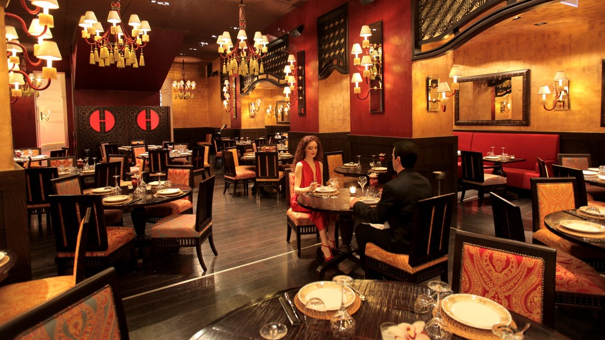
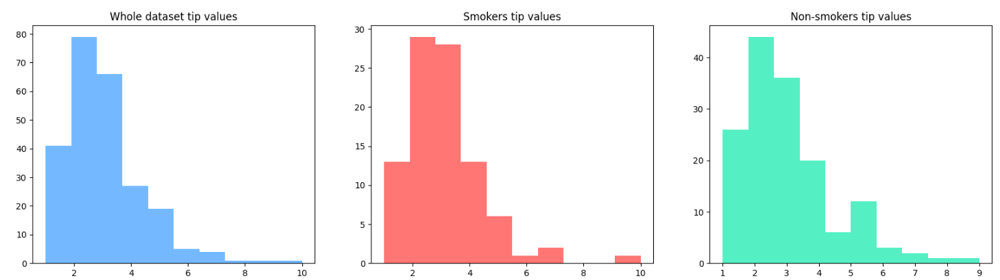

# RESTAURANT TIPS ANALYSIS



## Project description
This project aims to use the restaurant tips dataset to practice creating composition plots and visualizations. We will examine the relationship between different variables and the tips given.
## Source of the data
The dataset consists of information from 244 restaurant bills, collected in the US in 1987.
It includes details about the tips given to restaurant staff, such as the total bill, tip amount, gender of the person paying, smoking status, day of the week, time of day, and party size.
You can load the data from the following link: https://raw.githubusercontent.com/RusAbk/sca_datasets/main/tips.csv
## The main goals
Provide insights by comparing tip amount among different dimensional variables such as: smoker vs non-smoker, gender, day and time in day.
## Data overview

|    |   id |   total_bill |   tip | sex    | smoker   | day   | time   |   size |
|---:|-----:|-------------:|------:|:-------|:---------|:------|:-------|-------:|
|  0 |    0 |        16.99 |  1.01 | Female | No       | Sun   | Dinner |      2 |
|  1 |    1 |        10.34 |  1.66 | Male   | No       | Sun   | Dinner |      3 |
|  2 |    2 |        21.01 |  3.5  | Male   | No       | Sun   | Dinner |      3 |
|  3 |    3 |        23.68 |  3.31 | Male   | No       | Sun   | Dinner |      2 |
|  4 |    4 |        24.59 |  3.61 | Female | No       | Sun   | Dinner |      4 |

## Basic descriptive statistics

|       |       id |   total_bill |       tip |      size |
|:------|---------:|-------------:|----------:|----------:|
| count | 244      |    244       | 244       | 244       |
| mean  | 121.5    |     19.7859  |   2.99828 |   2.56967 |
| std   |  70.5809 |      8.90241 |   1.38364 |   0.9511  |
| min   |   0      |      3.07    |   1       |   1       |
| 25%   |  60.75   |     13.3475  |   2       |   2       |
| 50%   | 121.5    |     17.795   |   2.9     |   2       |
| 75%   | 182.25   |     24.1275  |   3.5625  |   3       |
| max   | 243      |     50.81    |  10       |   6       |

## Tip value influencers
### 🚬 Do people who smoke give more tips?

**The function compare_tip_dynamic_dimension(input_dimension) compares tip statistics by a specific group with the overall values in the dataset**
```python
 def compare_tip_dynamic_dimension (input_dimension):
  ## agg by dimension
  df_agg_detail = df.groupby(input_dimension).agg(tip_min = ('tip','min'),
                                                  tip_max = ('tip','max'),
                                                  tip_mean = ('tip','mean'),
                                                  tip_median = ('tip','median')
                                                  )
  df_agg_detail = df_agg_detail.T
  df_agg_detail = df_agg_detail.reset_index()
  ## agg all df
  df_agg = df.agg(tip_min = ('tip','min'),
                  tip_max = ('tip','max'),
                  tip_mean = ('tip','mean'),
                  tip_median = ('tip','median')
                  )
  df_agg.columns = ["common"]
  df_agg = df_agg.reset_index()
  ## merge
  df_compare = df_agg.merge(df_agg_detail,"inner",on = "index")
  return df_compare
```
```python
compare_tip_dynamic_dimension('smoker')
```
|    | index      |   common |      No |      Yes |
|---:|:-----------|---------:|--------:|---------:|
|  0 | tip_min    |  1       | 1       |  1       |
|  1 | tip_max    | 10       | 9       | 10       |
|  2 | tip_mean   |  2.99828 | 2.99185 |  3.00871 |
|  3 | tip_median |  2.9     | 2.74    |  3       |

**Insights**
- Smorkers tend to tip more than Non-smokers. Because the median tip of Smokers is about 8% higher than the median tip of Non-smokers. The mean tip of Smoker is greater the mean tip of Non_smokers.
- All customers who visited the restaurant at the time of data collection tipped the staff. The min tip is 1 USD and the max tip is 10 USD.
  
**General conclusion:** Smokers tips more than Non-smokers

**Look at histograms**



**Insights**

- Most smokers tip up to 4-5 USD,while the rest usually limit themself to around 2-3 USD
- The majority of people in all groups tend to give smaller tips.

**General conclusion:** The smokers tip more than non-smokers and the average

### 👨👩 Do males give more tips?

```python
compare_tip_dynamic_dimension (input_dimension = "sex")
```
|    | index      |   common |   Female |     Male |
|---:|:-----------|---------:|---------:|---------:|
|  0 | tip_min    |  1       |  1       |  1       |
|  1 | tip_max    | 10       |  6.5     | 10       |
|  2 | tip_mean   |  2.99828 |  2.83345 |  3.08962 |
|  3 | tip_median |  2.9     |  2.75    |  3       |

**Insights**

- Males tip more than females on average (3.09 vs 2.83) and median (3.0 vs 2.75).
- Maximum tip is higher for males (10.0 vs 6.5). Minimum tip is the same (1.0).

**Conclusion:** Male customers tend to give higher tips than female customers.

### 📆 Do weekends bring more tips?

```python
compare_tip_dynamic_dimension (input_dimension = "day")
```


|    | index      |   common |     Fri |     Sat |     Sun |    Thur |
|---:|:-----------|---------:|--------:|--------:|--------:|--------:|
|  0 | tip_min    |  1       | 1       |  1      | 1.01    | 1.25    |
|  1 | tip_max    | 10       | 4.73    | 10      | 6.5     | 6.7     |
|  2 | tip_mean   |  2.99828 | 2.73474 |  2.9931 | 3.25513 | 2.77145 |
|  3 | tip_median |  2.9     | 3       |  2.75   | 3.15    | 2.305   |

**Insights:**
- Sunday has the highest average tip (3.26) and median tip (3.15).
- Friday has the lowest tip average (2.73) and relatively lower max tip (4.73).
- Maximum tip is highest on Saturday (10.0), showing some big tips on weekends.
- Minimum tips are fairly consistent across all days (around 1.0).

**Conclusion** Sunday tends to have higher tipping behavior, while Friday shows the lowest tip amounts. This could inform service strategies by day of the week.

### 🕑 Do dinners bring more tips?

```python
compare_tip_dynamic_dimension (input_dimension = "time")
```

|    | index      |   common |   Dinner |   Lunch |
|---:|:-----------|---------:|---------:|--------:|
|  0 | tip_min    |  1       |  1       | 1.25    |
|  1 | tip_max    | 10       | 10       | 6.7     |
|  2 | tip_mean   |  2.99828 |  3.10267 | 2.72809 |
|  3 | tip_median |  2.9     |  3       | 2.25    |

**Insights**
- Dinner tips are higher than lunch tips in both average (3.10 vs 2.73) and median (3.0 vs 2.25).
- Maximum tip during dinner is also higher (10.0 vs 6.7).
- Minimum tips are slightly higher at lunch (1.25 vs 1.0).
**Conclusion:** Customers tend to tip more during dinner than lunch


  
